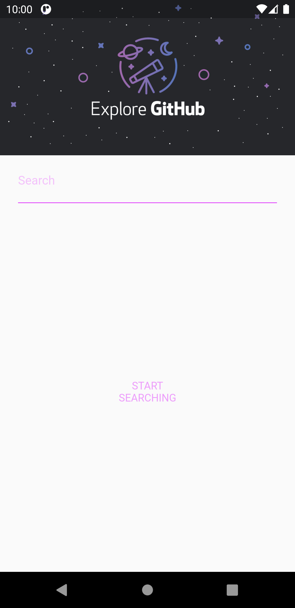
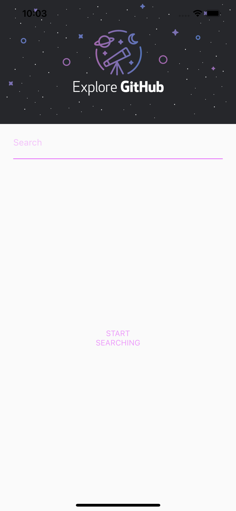
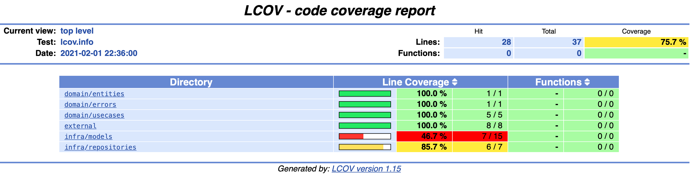

# Flutter & Clean Architecture - Github Search

<h1 align="center">
  
</h1>

I used this project to study a Clean Architecture and Flutter. Basically, this application calls Github API and get profiles according the user writes in a simple input text.
Further, I used [Bloc](https://pub.dev/packages/bloc) to state management and it has a unit tests for some layers (External, Domain, Infra) using TDD :grin:


## Author

#### Renata Oliveira
[](https://www.linkedin.com/in/renatafariaoliveira/)


## Requirements

This project was built using Flutter SDK [1.24.0-10.2.pre] and Dart [2.12.0].

* Any Operating System (ie. MacOS X, Linux, Windows)
* Any IDE with Flutter SDK installed (ie. Android Studio, VSCode, IntelliJ, etc)
* A little knowledge of Dart and Flutter

_Tip: For help getting started with Flutter, view
[online documentation](https://flutter.dev/docs)._

## Libs & Packages

**_dependencies_**
* [dartz](https://pub.dev/packages/dartz): Functional programming in Dart.
* [dio](https://pub.dev/packages/dio): HTTP client for Dart.
* [flutter_modular](https://pub.dev/packages/flutter_modular): Dependency injection, routing system and so on.
* [bloc](https://pub.dev/packages/bloc): Implement the BLOC pattern.
* [rxdart](https://pub.dev/packages/rxdart): Adds additional capabilities to Dart Streams and StreamControllers.

**_dev dependencies_**
* [mockito](https://pub.dev/packages/mockito): Mock library for Dart.
* [test_coverage](https://pub.dev/packages/test_coverage): Used to generate coverage reports locally.
* [remove_from_coverage](https://pub.dev/packages/remove_from_coverage): Ignore files in coverage reports matching given patterns.
* [flutter_launcher_icons](https://pub.dev/packages/flutter_launcher_icons): Update your app launcher icon.

## Screenshots

### Android
<h1 align="center">
  
  
</h1>

### iOS
<h1 align="center">
  
  
</h1>

## Github API - Response Example

```
{
  "total_count": 1,
  "incomplete_results": false,
  "items": [
    {
      "login": "renatafariaoliveira",
      "id": 15346909,
      "node_id": "MDQ6VXNlcjE1MzQ2OTA5",
      "avatar_url": "https://avatars.githubusercontent.com/u/15346909?v=4",
      "gravatar_id": "",
      "url": "https://api.github.com/users/renatafariaoliveira",
      "html_url": "https://github.com/renatafariaoliveira",
      "followers_url": "https://api.github.com/users/renatafariaoliveira/followers",
      "following_url": "https://api.github.com/users/renatafariaoliveira/following{/other_user}",
      "gists_url": "https://api.github.com/users/renatafariaoliveira/gists{/gist_id}",
      "starred_url": "https://api.github.com/users/renatafariaoliveira/starred{/owner}{/repo}",
      "subscriptions_url": "https://api.github.com/users/renatafariaoliveira/subscriptions",
      "organizations_url": "https://api.github.com/users/renatafariaoliveira/orgs",
      "repos_url": "https://api.github.com/users/renatafariaoliveira/repos",
      "events_url": "https://api.github.com/users/renatafariaoliveira/events{/privacy}",
      "received_events_url": "https://api.github.com/users/renatafariaoliveira/received_events",
      "type": "User",
      "site_admin": false,
      "score": 1.0
    }
  ]
}
```

## Tests Coverage

Currently, it has a unit tests for some layers. Coverage report:

<h1 align="center"></h1>